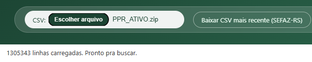
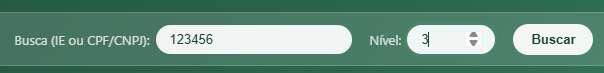
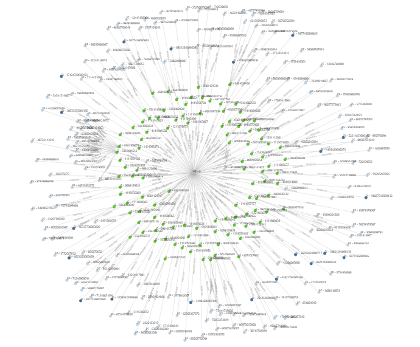
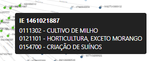

# Grafo de Vínculos IE / CPF-CNPJ

Página web local (sem servidor, sem instalação) que lê a base de Inscrições
Estaduais ativas da SEFAZ-RS e desenha um grafo mostrando quais CPF/CNPJ
estão vinculados a quais Inscrições Estaduais — útil para enxergar rápido
"quem tem o quê" e "quem está ligado a quem" numa consulta.


## O que ela faz

- Lê o CSV oficial da SEFAZ-RS (ou o `.zip` baixado direto do site, sem
  precisar extrair manualmente).
- Busca por **Inscrição Estadual** ou **CPF/CNPJ** — detecta sozinho qual dos
  dois você digitou.
- Expande o grafo por "graus de separação" (nível 1, 2, 3...): a partir do
  ponto buscado, mostra também quem mais está ligado àquele CPF/CNPJ, e às
  Inscrições que aparecem a partir daí.
- Mostra o **nome de cada CNAE** (atividade econômica) ao passar o mouse ou
  clicar numa bolinha de Inscrição Estadual.
- Deixa baixar, em CSV, só as linhas que estão aparecendo no grafo atual.
- Roda 100% no seu navegador — nenhum dado sai da sua máquina, não tem
  servidor, não tem internet envolvida (a não ser pra baixar o CSV da SEFAZ).

## Requisitos

- Um navegador moderno (Chrome, Edge, Firefox).
- Nenhuma instalação, nenhum Python, nenhum Node — isso é só pra quem for
  mexer no código/testes (veja [Desenvolvimento](#desenvolvimento)).

## Como usar

### 1. Abra a página

Baixe (ou clone) esta pasta inteira e dê duplo clique em `consulta.html`.
Se o navegador reclamar de carregar os arquivos locais, rode um servidor
simples na pasta e abra `http://localhost:8000/consulta.html`:

```bash
python -m http.server 8000
```

### 2. Carregue o CSV

Clique em **"Baixar CSV mais recente (SEFAZ-RS)"** pra baixar a base mais
atual direto do site oficial. Depois, no campo **CSV**, selecione o arquivo
baixado — funciona tanto com o `.csv`/`.txt` extraído quanto com o `.zip`
direto, sem precisar descompactar na mão.



Quando carregar, o texto abaixo da barra mostra quantas linhas foram lidas
e o botão **Buscar** libera.

### 3. Busque por IE ou CPF/CNPJ

Digite o número no campo de busca (com ou sem zeros à esquerda, tanto faz)
e escolha o **Nível** — quantos "saltos" o grafo deve expandir a partir do
ponto buscado. Nível 1 mostra só os vínculos diretos; nível mais alto puxa
vínculos de vínculos.



Clique em **Buscar**.

### 4. Leia o grafo



- **Bolinha verde** = Inscrição Estadual.
- **Bolinha azul-clara** = pessoa física (CPF).
- **Bolinha azul-escura** = pessoa jurídica (CNPJ).
- As linhas mostram a **Categoria** (ex: PRODUTOR, MICROPRODUTOR) do vínculo.
- Arraste as bolinhas pra reorganizar, use a rodinha do mouse pra dar zoom e
  arraste o fundo pra mover o grafo.

Passe o mouse (ou clique, pra deixar fixo) numa bolinha verde de Inscrição
pra ver os CNAEs (atividades econômicas) daquela Inscrição, com nome por
extenso:



Se a busca não encontrar nada, o grafo é limpo e aparece um aviso em
vermelho.

### 5. Baixe os dados do grafo atual

O botão **"Baixar dados do grafo"** (ao lado de Buscar) exporta em CSV só as
linhas que estão sendo mostradas na tela naquele momento — mesmo formato do
CSV original (`Inscrição;Data Abertura;Categoria;CNAE_1;CNAE_2;CNAE_3;Tipo;CPF/CNPJ`),
pronto pra abrir no Excel.


## Sobre os dados

- Fonte: `http://www.sefaz.rs.gov.br/ASP/Download/Sitagro/PPR_ATIVO.zip`
  (Produtores Rurais ativos, SEFAZ-RS).
- Encoding do arquivo: `windows-1252` (acentuação de export de sistema
  legado do governo) — a página já trata isso sozinha.

## Limitações conhecidas

- Não dá pra abrir a URL da SEFAZ-RS automaticamente de dentro da página —
  o servidor deles não libera CORS pra isso. Por isso o fluxo é
  baixar → selecionar arquivo, em vez de 100% automático.
- Arquivo é grande (~100MB, 1.3 milhão de linhas) — carregar pode levar
  alguns segundos, e a aba trava durante esse tempo (é inerente a processar
  um arquivo desse tamanho no navegador, sem servidor).

## Desenvolvimento

Lógica de busca/grafo (`assets/consulta-core.js`) é testada com o test
runner nativo do Node:

```bash
node --test tests/consulta-core.test.js
```

Estrutura:
- `consulta.html` — página, estilo, renderização do grafo (D3).
- `assets/consulta-core.js` — lógica pura (parsing, índices, busca,
  expansão do grafo, exportação CSV) — sem dependência de DOM, testável.
- `assets/consulta-ui.js` — liga a página aos dados (leitura de arquivo,
  zip, eventos de clique).
- `assets/cnae-names.js` — tabela código→nome de CNAE (fonte: API do IBGE).
- `lib/` — D3, PapaParse e fflate vendorizados (sem CDN, funciona offline).

## Licença

Código livre para uso, cópia e modificação, sem garantias — Licença MIT.

Por Vilquer de Oliveira.
